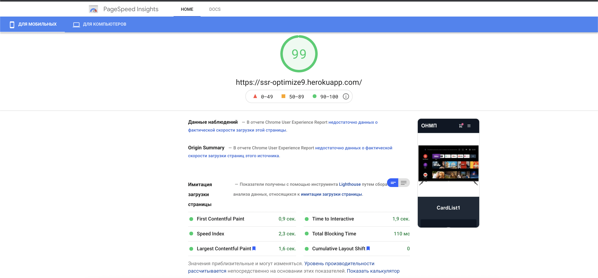

# Оптимизация производительности ssr-приложений

Кто бы что не говорил о метриках производительности, мол это все ерунда и ни кому кроме гугла не нужно.
Но, во-первых, я так не считаю, а во вторых у нас есть заказчики, которым это важно 
и они задачи по оптимизации производительности нам ставят, 
и, даже если по Вашему высокопрофессиональному мнению они заблуждаются, то делать их надо.

Не буду пересказывать рекламные лозунги про _500% пользователей покидают страницу после 100мс ожидания_,
_увелечения конверсии на 20% при снижении LCP на 2мс_... читайте сами.
Скажу коротко: метрики производительности важны.

## Какие метрики?

Мерилом выберем PageSpeed.

Расшифровка аббревиатур:

- FCP - через сколько пользователь увидит хоть что-нибудь.
- LCP - когда загрузился самый большой видимый контент
- TTI - time to interactive (не знаю что еще добавить)
- TBT - total blocking time
- CLS - сдвиг контента после полной загрузки 

Современный фронт не мыслит себя spa. И было бы все отлично, если бы не несколько но:

- SEO - не все поисковики умеют в JS, а те что умеют не факт, что дождутся загрузки всех скриптов.
- LCP, FCP, TBT, TTI - JS... Его много. Нет не так, **его очень много**.
И пока он не загрузится, пользователь ни чего не увидит. 
Пока скрипты не распарсятся и не запустятся, не сможет нажать кнопку _Оплатить_.

Тут нам на помощь спешит еще одна новомодная технология (уже нет): server side rendering.
Он (серверный рендеринг) отлично решает проблемы c SEO, FCP и LCP. 
И усугубляет и без того не очень радостную картину с TBT

В статье покажу несколько техник, которые позволяют хоть как то решить вышеописанные проблемы.

Измерять будем для мобилок, т.к. давайте смотреть правде в глаза: 
скайнет выйдет не из министерства обороны, а из распределенной сети смартфонов,
они уже захватили интернет. 
Да и обеспечив приемлемую скорость работы приложения на мобильных устройствах
зеленые метрики для десктопа получим автоматом.

## Что наше супер приложение делает

Для тестов построим приложение на базе фреймворка nuxt.js. 
Но описанные решения для приложений на react.js то же работают - проверил на next.js

Приложение представляет собой одну страницу из шапки и 10 секций
(я их просто скопипастил, чтобы не выдумывать). Каждая показывает 10 карточек с товарами (сначала были котики).
Данные каждая секция запрашивает самостоятельно на бекенде
(через axios запрашиваем json, который лежит в static) в методе fetch. 
Так же на сервере (в nuxt server init) есть запрос за категориями, 
из которых будем строить меню. 
Респонсы взял у одного из крупнейших интернет-магазинов России.

> Для тех кто не пользовался nuxt:
>
>У компонента есть метод для получения данных fetch,
> который вызывается при первом рендере компонента
> (неважно на сервере он происходит или на клиенте).
> Если рендер происходит на сервере,
> то данные запрашиваются, компонент рендерится (вставляется в документ),
> на клиенте происходит гидротация этих данных.
>
> Метод nuxtServerInit предназначен для инициализации сторы,
> вызывается только на сервере, получает данные, складывает их в стору,
> на клиенте мы получаем предзаполненную стору.

## Инициализация проекта

Стартуем проект как написано в документации через `yarn create nuxt-app`.

Для теста подключим UI-библиотеку BalmUI. 
Я эту библиотеку раньше не видел, не использовал, не слышал — именно это стало
решающим в выборе.

Для тестов и замеров перфоманса, чтобы было все честно, нам нужно задеплоить наше приложение. 
Для это используем [heroku](https://heroku.com/). 
Подключаем репозиторий. Жмем ок. 
Вот, в пару кликов мир увидел
наше [Приложение](https://nuxt-optimize.herokuapp.com/)

Одновременно работают несколько инстансов, 
отражающие разное состояние оптимизации: ссылки вида 
`https://ssr-optimize2.herokuapp.com/` - `https://ssr-optimize9.herokuapp.com/`

Да, с фантазией у меня не очень... Знаю.

## Первый тест

Открываем page-speed, вставляем наш url, жмем _анализировать_, о!!!, 98 попугаев. На этом месте идут хвалы создателям
vue и nuxt. А на мобилках? Упс... 57? За что? Смотрим ниже:

- __Устраните ресурсы, блокирующие отображение__ `/tailwind.min.css`
- __Удалите неиспользуемый код CSS__ `/tailwind.min.css`
- __Удалите неиспользуемый код JavaScript__ 345kiB
- __Сократите время до получения первого байта от сервера__ 1180ms

### Разбираемся

Открываем devtools -> network


Чтобы было понятней, что там грузится, допишем в конфиг:

```javascript
// nuxt.config.js

build: {
  filenames: {
    chunk: () => '[name].[id].[contenthash].js'
  }
}
```

Это позволяет увидеть человекочитаемые имена чанков,

#### tailwind

Мы же не подключали... Поиск по проекту, и ага! Это подключено в демо-компоненте, причем link внутри template. Сносим.

> Несмотря на то, что эта проблема не возникла бы в реальном приложении оставил,
> что бы показать куда надо смотреть в первую очередь

### Вторая попытка

Коммитим, дожидаемся [деплоя](https://ssr-optimize2.herokuapp.com/), смотрим:


80. Уже лучше, но не "зелененькое". Из явных проблем осталось только:

- __Удалите неиспользуемый код JavaScript__ 345kiB

И иногда (разные итерации теста показывают разные результаты):

- __Сократите время до получения первого байта от сервера__ 811ms

### Разбираемся 2

#### Сократите время до получения первого байта от сервера

Чтобы больше на этом не останавливаться, расскажу о втором.

Нужно понимать, что происходит при обращении по url нашего приложения. Запрос с клиента попадает в веб-сервер nuxt,
который рендерит документ. Он делает много работы, поэтому это не быстро. Так как page-speed не учитывает эту метрику в
своих оценках, то и я не буду останавливаться на этом. Скажу только, что лечится это кешированием. Для этого лучше
использовать отдельный сервер, например, __nginx__

#### Неиспользуемый код

Ну тут ни чего пока страшного: мы взяли огромный мощный инструмент, а вывели на экран одну строчку. Очевидно, что
фреймворк (сам nuxt и vue) вносят какой-то оверхед. А мы его не используем.

Но 345 kiB ?!

В nuxt есть замечательный инструмент для анализа бандла, основанный
на [webpack-bundle-analyzer](https://github.com/webpack-contrib/webpack-bundle-analyzer):

```bash
yarn nuxt build -a
```


Вот оно: __BalmUI__

##### UI библиотеки

И это огромная проблема: нам нужна библиотека, нам же лень делать базовые компоненты.

Тут первый вопрос которым стоит задаться: а можно ли не подключать библиотеку глобально, а использовать только то, что
надо? Так, чтобы в бандл попадали только используемые зависимости?

Все зависит от используемой библиотеки, от того как она собирается... Сборщики пока еще не важно умеют
в [tree-shaking](https://developer.mozilla.org/en-US/docs/Glossary/Tree_shaking)
Далеко не каждая библиотека позволяет это сделать, наш BalmUI, например, нет (ну или я не нашел как это сделать).
Vuetify тоже не позволяет (ходят слухи, что это не так).

> Причем это касается не только сторонних библиотек, но и внутренних.
> При старте разработки библиотеки обратите на это особое внимание,
> помимо возможности подключения отдельного компонента,
> проверьте точно ли при подключении кнопочки не тянется вся библиотека целиком.

> Открыл статью "15 лучших UI библиотек для vue.js 2021", попробовал все...
> Ни одна не позволила подключить только кнопочку.
> Пользователям react в этом плане попроще.

Если на первый вопрос ответ отрицательный, то есть второй вопрос: готовы ли мы платить за использование этой библиотеки?

Тут можно возразить, что на данном этапе код библиотеки на самом деле неиспользуемый, но по мере разработки все больше и
больше будет использоваться. Но это не так. Современные инструменты позволяют нам разделить код как минимум по
маршрутам. Nuxt это умеет делать из коробки. На странице будет использоваться вся UI библиотека? Навряд ли.

В итоге идем в конфиг, удаляем подключение библиотеки. Подключим tailwind (стили все еще лень писать).

Снова запускаем анализ бандла, получаем такую картинку:


##### auto imports

Уже лучше, но что это в нижнем левом углу? Откуда тут `Tutorial.vue`? Мы же его не используем. Дело в авто-импорте
компонентов. Убираем это в конфиге `components: false,`

[Деплоим](https://ssr-optimize3.herokuapp.com/) и тестируем еще раз:


##### modern mode

Вроде 92 это не плохо, но не забываем, что у нас страница на которой только заголовок

- __Удалите неиспользуемый код JavaScript__ 33 KiB

Тут подходим к неочевидному моменту. А именно поддержка старых браузеров. Nuxt поддерживает браузеры начиная с IE9.
Соответственно код изобилует различными полифилами. Но, все не так плохо. В Nuxt есть опция modern, которая говорит
'сделай мне два бандла — один для старых браузеров, второй для новых, и когда клиент придет, посмотри user-agent и отдай
ему, что надо'.

Включаем эту волшебную штуку в конфиге `modern: true`

> это не только nuxt такой расчудесный. [Статья о modern](https://philipwalton.com/articles/deploying-es2015-code-in-production-today/)

[Деплоим](https://ssr-optimize4.herokuapp.com/). Тестируем еще раз:


Ну вот, 99, так-то лучше, только остались без UI либы.

### Итоги инициализации

- глобальные зависимости зло

- не забываем про modern

- выключаем auto-import


## Первый запуск

И так, тестовый стенд [написан и задеплоен](https://ssr-optimize5.herokuapp.com/), смотрим что нам показывает
page-speed:


48. Рекомендации по устранению:


Проблемы с картинками и со сдвигом контента и способы их устранения общие для всех web-приложений, неважно на каких
технологиях сделан проект. Поэтому не буду подробно на них останавливаться, просто зачиним:

- все картинки переведем в webp;
- отресайзим изображения для разных устройств (у нас один размер 375px);
- зададим размер верхнему изображению (что бы не было смещения при загрузке изображения);
- поставим атрибут loading="lazy" для все картинок

[Итог](https://ssr-optimize6.herokuapp.com/):


78... Кто-то может сказать, что 78 приемлемый результат. И это действительно так (перфекционистов в ад). Но у нас
приложение, которое по сути не содержит ни какого функционала, ни какой интерактивности. В реальном приложении циферки
будут совсем другие.

Основная наша проблема кроется в метрике **Total Blocking Time** 690 мс

## Dynamic imports & lazyHydration

Чтобы понять, что происходит, давайте попробуем разобраться, что именно мы отдаем клиенту.

### Dynamic imports

Для начала обратимся к такой полезной фиче вебпака,
[как разделение кода и волшебные комментарии](https://webpack.js.org/guides/code-splitting/). В компоненте страницы у
нас есть такие строчки:

```javascript
import CardList1 from "~/components/CardList/CardList1";
```

Здесь мы импортируем компонент для дальнейшего использования. Вынесем его в отдельный чанк:

```javascript
const CardList1 = () => import(/* webpackChunkName: "CardList1" */ '~/components/CardList/CardList1.vue')
```

Настоящая магия!
Теперь запустив наше приложение и открыв devtools, увидим там, что мы грузим на клиент
файл `CardList1.1.f29585b.modern.js`. Заглянем в него.

Читать машинно-сформированный код удовольствие так себе, но при взгляде становится понятно, что чанк содержит код нашего
компонента `CardList1`.

А что если он нам не нужен?

Как? А для чего же мы его писали?

Во-первых, есть компоненты, которые достаточно отрендерить один раз в виде html и больше ни когда не трогать. В нашем
приложении все компоненты такие, т.е. они не будут меняться. Нам нужно отобразить их в документе и больше не трогать.

Во-вторых, для подавляющего количества компонентов верно следующее:
если в документе у нас есть разметка компонента, то код для него нам нужен не сразу
(либо не нужен вовсе, п.1), а при срабатывании различных триггеров — когда он попадает во вьюпорт, пользователь где-то
что-то нажал, или произошло другое событие...

### LazyHydration

Тут нам на помощь спешит недооцененная и изящная библиотека
[vue-lazy-hydration](https://github.com/maoberlehner/vue-lazy-hydration])

Она позволяет отложить гидротацию компонента.

Использование очень простое. Библиотека предоставляет компоненты, в которые оборачивается целевой компонент

```html

<LazyHydrate when-visible>
  <CardList10 :products-group="2"/>
</LazyHydrate>
```

Вставим в хук mounted компонента CardList console.log, обернем все секции на странице в LazyHydrate, первым двум
поставим атрибут `never`, что говорит LazyHydrate не гидратировать компонент никогда, остальным поставим
атрибут `when-visible`.

[запускаем проект](https://ssr-optimize7.herokuapp.com/), скролим вниз и видим, что наши сообщения появляются не сразу,
а по мере скрола страницы, начиная с компонента CardList3. Т.е. код компонента выполнятся по мере необходимости.


Осталась маленькая проблема: чанк для компонента все еще грузится сразу, дело в том что код компонента `index`
исполняется сразу, и импорт дочерних компонентов происходит в момент рендера. Добавим обертку над целевым компонентом:

```vue

<template>
  <CardList10
    :products-group="productsGroup"/>
</template>

<script>
const CardList10 = () =>
  import(/* webpackChunkName: "CardList10" */ '~/components/CardList/CardList10.vue')

export default {
  name: "LazyCardList10",
  components: {CardList10},
  props: {
    productsGroup: {
      type: Number,
      required: true
    },
  },
}
</script>

```

Все равно грузится... беда!
Происходит это из-за того, что
[ссылки на динамические чанки вставляются в документ](https://github.com/vuejs/vue/issues/9847#issuecomment-626154095):
```<link rel="preload" href="..." as="script">```.

К счастью, там же есть решение. Несколько костыльное, но рабочее.

Теперь загрузка компонентов CardList происходит в момент маунта компонента LazyCardList, который в свою очередь
маунтится когда ему "разрешит" LazyHydration. Ставим всем компонентам на странице `LazyHydrate when-visible`

[Деплоим](https://ssr-optimize8.herokuapp.com/)

Вот что вышло:


и тестируем:


Ну вот уже зелененькие. 
Но помним, что у нас тестовый стенд, упрощенный по сравнению с реальными приложениями.

### Решение для react

Аналогичное решение можно применить и адептам react.

В react для ленивой гидротации есть 
[react-lazy-hydration](https://github.com/hadeeb/react-lazy-hydration)

Реализовал ленивую загрузку чанков в приложении на базе _next.js_.
[Вот реализация](https://github.com/RokeAlvo/next-lazy-example).

Столкнулся с такой же проблемой как и в приложении _nuxt_: 
чанки грузятся в независимости от гидротации компонента. 
Решение аналогичное: убрать ссылки на чанки из документа.
Вся магия происходит в файле 
[_document.js](https://github.com/RokeAlvo/next-lazy-example/blob/b58affa42f13caaa8960a77d39ae6550adc5fbc8/pages/_document.js)

Использование простое: при динамическом импорте добавляем к имени чанка `DYNAMIC_IMPORT`

```javascript
const Section1 = dynamic(() =>
    import(/*webpackChunkName: "Section1_DYNAMIC_IMPORT"*/'./Section1').then((module) => module.Section1)
)
```

Решение не идеальное. Например, в дев режиме теряются стили компонентов.

## Данные

Пришло время посмотреть на результат рендера страницы, т.е. на документ, который отдает нам сервер.

```html
<!doctype html>
<html data-n-head-ssr lang="en" data-n-head="%7B%22lang%22:%7B%22ssr%22:%22en%22%7D%7D">
<head>
  <title>ssr-optimize</title>
  <meta data-n-head="ssr" charset="utf-8">
  <meta data-n-head="ssr" name="viewport" content="width=device-width, initial-scale=1">
  <meta data-n-head="ssr" data-hid="description" name="description" content="">
  <meta data-n-head="ssr" name="format-detection" content="telephone=no">
  <link data-n-head="ssr" rel="icon" type="image/x-icon" href="/favicon.ico">
  <link rel="preload" href="/_nuxt/modern-5c24fa509ceadba62ea6-app.js" as="script">
  <link rel="preload" href="/_nuxt/modern-0132d18578b8258d8277-commons/app.js" as="script">
  <link rel="preload" href="/_nuxt/modern-14af1aa6b1c6157916b2-app.js" as="script">
  <link rel="preload" href="/_nuxt/modern-c537fab69dd96158deb6-pages/index.js" as="script">
  <style
    data-vue-ssr-id="382a115c:0 0b721bb1:0 1af339ee:0">/*! tailwindcss v2.2.17 | MIT License | https://tailwindcss.com*/
  /* строка 16        */
  /*! modern-normalize v1.1.0 | MIT License | https://github.com/sindresorhus/modern-normalize */

  /*
  Document
========
*/

  /**
Use a better box model (opinionated).
*/

  *,
  ::before,
  ::after {
    box-sizing: border-box;
  }

  /**
Use a more readable tab size (opinionated).
*/

  html {
    -moz-tab-size: 4;
    -o-tab-size: 4;
    tab-size: 4;
  }

  /* ---------------- more css rows ---------------------------------- */
  .main-image {
    width: 375px;
    height: 375px
  }

  /*purgecss end ignore*/</style>
  <!--- строка 1082 ------------>
</head>
<body>
<div data-server-rendered="true" id="__nuxt"><!---->
  <div id="__layout">
    <div class="default-layout relative">

      <!----- more html rows ----------------------------------------------->

    </div>
  </div>
</div>
<!-- строка 2444-->
<script>
  window.__NUXT__ = (function (a, b, c, d, e, ...
  ..........)
  {
    return {
      layout: "default",
      data: [{}],
      fetch: {
        "CardList1:0": {
          products: [{
            productId: bb,
            name: dp,
            nameTranslit: dq,
            brandName: as,
            materialSource: n,
            productType: M,
            images: [dr, bc, ds, dt, du, dv, dw],
            vendorCatalog: a,
            partnerType: a,
            category: {id: at, name: ar},
            materialCisNumber: bb,
            description: a,
            modelName: dx,
            properties: {
              key: [{
                name: bd,
                priority: e,
                properties: [{
                  id: be,
                  name: bf,
                  value: bg,
                  nameDescription: a,
                  valueDescription: a,
                  priority: e,
                  measure: a
                }]
              }, {
                name: au,
                priority: t,
                properties: [{


  // Много похожего....

  //  строка 24660
</script>
<script src="/_nuxt/modern-5c24fa509ceadba62ea6-app.js" defer></script>
<script src="/_nuxt/modern-c537fab69dd96158deb6-pages/index.js" defer></script>
<script src="/_nuxt/modern-0132d18578b8258d8277-commons/app.js" defer></script>
<script src="/_nuxt/modern-14af1aa6b1c6157916b2-app.js" defer></script>
</body>
</html>

```

Структура нашего документа примерно такая:

- строки 16 - 1 084 стили

- строки 1084 - 2 444 разметка

- строки 2444 - __24 660__ - данные для гидротации

Что?! 22k строк данных для гидротации? Откуда?

Внимательно присмотревшись к структуре этого безобразия, можно увидеть строки типа:

```javascript
{
  layout: "default",
  data: [{}],
  fetch: {
    "CardList1:0": {
      products: [{
        productId: bb,
        name: dp,
        nameTranslit: dq,
        brandName: as,
        materialSource: n,
        // и еще куча полей с вложенными данными
      }]
    }
  }
}
```

Это результаты наших фетчей. 
Так же можно найти и наши сторы с предзаполненными данными (помните, категории запрашивал?)

Т.е. происходит следующее:

- на сервере компонент запрашивает products

- получает json на 10к строк

- сохраняет это к себе в стору

- данные внедряются на страницу, что бы потом быть гидратированы

Зачем нам столько данных о товаре, если нам для отображения надо _name_, _category_, _image_ ?

Надо что-то с этим делать.

- есть модное решение __graphql__

- можно научить бекенд принимать фильтр с требуемыми полями `?fields="name,image,category.name"`

- ну и наконец, если один из первых двух вариантов не возможен, 
  то количество гоняемых по сети данных оставим на совести бекендеров, 
  а вот количество данных для гидротации снизим просто добавив мапер

В месте получения данных добавляем вызов мапера:

```javascript
export function mapApiProductsToProducts(productList) {
  return productList.map(product => ({
    name: product.name,
    category: product.category.name,
    image: product.image
  }))
}
```

Деплоимся, замеряем:


96. Ну почти... но все еще не 100.

Раз уж мы взялись смотреть на данные для гидротации, давайте посмотрим на них еще раз. 
Все еще много - у нас остался запрос за категориями. 
Напомню, это данные для построения выпадающего меню.

С одной стороны, для первого отображения они не нужны, 
и можно смело перенести этот запрос с сервера на клиент и
запрашивать их при клике по бургеру. 
Но это ухудшит отзывчивость нашего интерфейса.

Можно не обращать на это внимания. А можно разделить этот большой запрос на несколько этапов:

- на сервере запрашиваем только первый уровень меню
- при открытии меню запрашиваем остальное (или опять только следующий уровень)

Давайте посмотрим что нам это даст, причем даже не будем менять мок нашего бека, 
а поступим так же как с продуктами,
т.е. смапим - в стору положим только первый уровень каталога.

[Деплоимся и тестируем](https://ssr-optimize9.herokuapp.com/)



## Заключение

Берегите пользователя. Заботьтесь о его телефончике. Не грузите лишнего.

Ну и самое главное: современный фронтенд сложный, многоликий, тяжелый... 
но не забывайте, что это все еще просто html, css и js.

Как то так.


  
