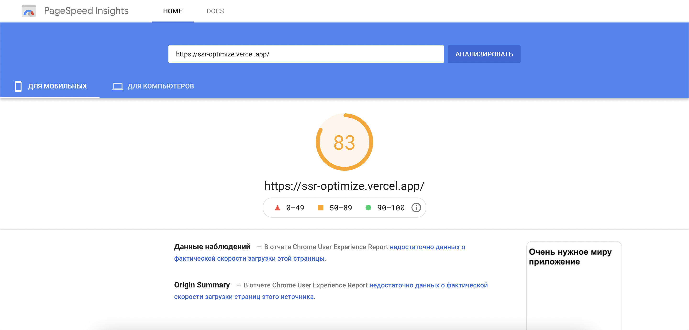
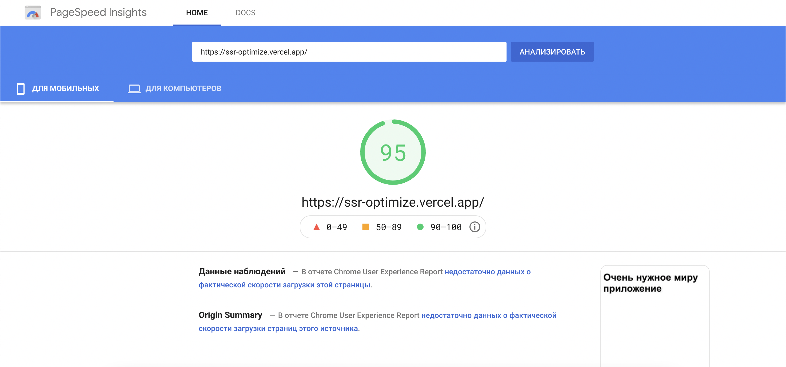

## Инициализация проекта

Стартуем проект как написано в документации через `yarn create nuxt-app`.

Сразу подключим библиотеку для UI (просто лень стили писать). Я эту бибилиотеку раньше не видел, не использовал, 
не слышал - именно это стало решающим в выборе.

Для тестов и замеров перфоманса, что бы было все честно, нам нужно задеплоить наше приложение. 
Мне очень нравится  [vercel]( https://vercel.com/) за скорость и простоту. 
Все что нужно, это сказать из какого репозитория брать код, остальное происходит "как то само"...
Почти. 
Потому что именно для nuxt приложения в ssr-режиме надо чуть [подготовить проект](https://nuxtjs.org/deployments/vercel).
Вот в пару кликов мир увидел наше [Приложение](https://ssr-optimize.vercel.app/)

## Первый тест

Открываем page-speed вставляем наш url жмем _анализировать_, о!!!, 98 попугаев, 
на этом месте идут хвалы создателям vue и nuxt... А на мобилках? Упс... 57? За что?
Смотрим ниже:

- __Устраните ресурсы, блокирующие отображение__ `/tailwind.min.css`
- __Удалите неиспользуемый код CSS__ `/tailwind.min.css`
- __Удалите неиспользуемый код JavaScript__ 345kiB
- __Сократите время до получения первого байта от сервера__ 1180ms

### Разбираемся

Открываем devtools -> network


что бы было понятней что там грузиться в конфиг допишем:
```javascript
build: {
  filenames: {
    chunk: () => '[name].[id].[contenthash].js'
  }
}
```

#### tailwind

Мы же не подключали... Поиск по проекту, и ага!, это подключено в демо-компоненте. Сносим. 
> Несмотря на то, что эта проблема не возникла бы в реальном приложении оставил,
> что бы показать куда надо смотреть в первую очередь

## Вторая попытка

Коммитим, дожидаемся деплоя, смотрим:



82. Уже лучше, но не "зелененькое", из явных проблем осталось только:
- __Удалите неиспользуемый код JavaScript__ 345kiB

И иногда (разные итерации теста показывают разные результаты):
- __Сократите время до получения первого байта от сервера__ 811ms

### Разбираемся 2

#### Сократите время до получения первого байта от сервера

Что бы больше на этом не останавливаться расскажу о втором.

Нужно понимать, что происходит при обращении по url нашего приложения.
В итоге запрос попадает в веб-сервер nuxt, который рендерит документ.
Он делает много работы, поэтому это не быстро. 
Так как page-speed не учитывает эту метрику в своих оценках, 
то и я не буду останавливаться на этом. 
Скажу только, что лечится это кешированием. 
Для этого лучше использовать отдельный сервер, например, __nginx__

#### Неиспользуемый код

Ну тут ни чего пока страшного: мы взяли огромный мощный инструмент, 
а вывели на экран одну строчку. 
Очевидно, что фреймворк (сам nuxt и vue) вносят какой-то оверхед.
А мы его не используем.

Но 345 kiB ?!

В nuxt есть замечательный инструмент для анализа бандла:
```bash
yarn nuxt build -a
```


Вот оно: __BalmUI__ 

И это огромная проблема: нам нужна библиотека, нам же лень делать базовые компоненты.

Тут первый вопрос которым стоит задаться: а можно ли не подключать библиотеку глобально, 
а использовать только то, что надо? Так, чтобы в бандл попадали только используемые зависимости.

Все зависит от используемой библиотеки, от того как она собирается... 
Далеко не каждая библиотека позволяет это сделать, наш BalmUI, например, нет (ну или я не нашел как это сделать)
Vuetify то же не позволяет (ходят слухи, что это не так)

>Причем это касается не только сторонних библиотек, но и внутренних. 
> При старте разработки библиотеки обратите на это особое внимание, 
> помимо возможности подключения отдельного компонента, 
> проверьте точно ли при подключении кнопочки не тянется вся библиотека

Если на первый вопрос ответ отрицательный, то второй: готовы ли мы платить за использование этой библиотеки

Тут можно возразить, что на данном этапе код библиотеки на самом деле не используемый,
но по мере разработки все больше и больше будет использоваться.
Но это не так. Современные инструменты позволяют нам разделить код как минимум по маршрутам.
Nuxt это умеет делать из коробки. На странице будет использоваться вся UI библиотека? Навряд ли.

В итоге идем в конфиг, удаляем подключение библиотеки.

Снова запускаем анализ бандла, получаем такую картинку:


Уже лучше, но что это в нижнем левом углу? Откуда тут `Tutorial.vue`? Мы же его не используем.
Дело в авто-импорте компонентов. Убираем это в конфиге `components: false,`

И тестируем еще раз:



Вроде 95 это не плохо, но не забываем, что у нас страница на которой только заголовок

- __Удалите неиспользуемый код JavaScript__ 90 kiB

Тут подходим к неочевидному моменту. А именно поддержка старых браузеров.
Nuxt поддерживает браузеры начиная с IE9. Соответственно код изобилует различными полифилами.
Но, все не так плохо. В Nuxt есть опция modern,
которая говорит 'сделай мне два бандла - один для старых браузеров, второй для новых, 
и когда клиент придет, посмотри user-agent и отдай ему, что надо'.

Включаем эту волшебную штуку в конфиге `modern: true`

>это не только nuxt такой расчудесный. [Статья о modern](https://philipwalton.com/articles/deploying-es2015-code-in-production-today/)

Тестируем еще раз:
